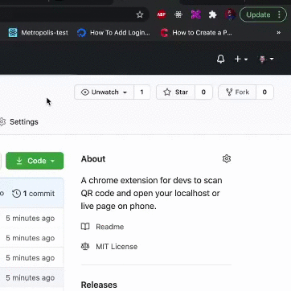

# Chrome Extension for developers to test local apps on real phones.📲

## Important! - It will be soon available on chrome extensions store, i need to wait for app approval.


There are times when you need to test your app on real phones but you didn't deploy your site on the server so you can see it on your real device. We all know one option, you need to find your local ip address and port that your app is running and manually write it in your phone browser, that can be hard sometimes because example you have big url query or you need to test different urls etc... 

In these situation this chrome extension come in game, when you are on you desired page localhost or some other url you just press it and it will generate QR code that u scan with your phone and bum 🎉 it open on your phone exactly like on your machine.



## Installing and Running

### Procedures:

1. Check if your [Node.js](https://nodejs.org/) version is >= **14**.
2. Clone this repository.
3. Run `npm install` to install the dependencies.
4. Run `npm start`
5. Load your extension on Chrome following:
   1. Access `chrome://extensions/`
   2. Check `Developer mode`
   3. Click on `Load unpacked extension`
   4. Select the `build` folder.
6. Happy hacking.

## Webpack auto-reload and HRM

To make your workflow much more efficient this boilerplate uses the [webpack server](https://webpack.github.io/docs/webpack-dev-server.html) to development (started with `npm start`) with auto reload feature that reloads the browser automatically every time that you save some file in your editor.

You can run the dev mode on other port if you want. Just specify the env var `port` like this:

```
$ PORT=6002 npm run start
```

## Packing

After the development of your extension run the command

```
$ NODE_ENV=production npm run build
```

Now, the content of `build` folder will be the extension ready to be submitted to the Chrome Web Store. Just take a look at the [official guide](https://developer.chrome.com/webstore/publish) to more infos about publishing.

